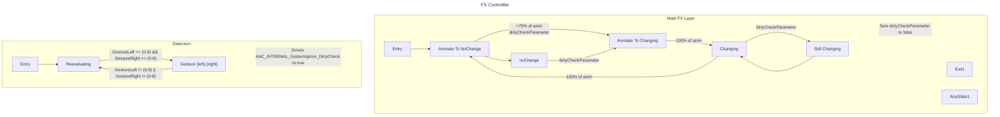

# Using Parameter Drivers

This example shows:

- Driving parameters using VRC Parameter Driver behavior
- VRChat Parameters
- Creating systems with multiple FX layers
- Complex transitions

[toggle](https://raw.githubusercontent.com/Happyrobot33/av3-animator-as-code/main/Packages/com.happyrobot33.animatorascode/Editor/Framework/Examples/GenExample3_Gesturing.cs ":include :type=code csharp")
