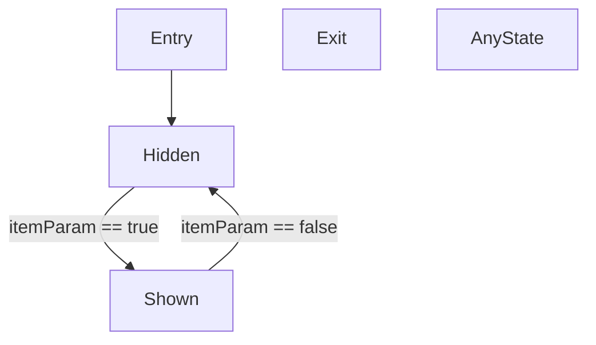

# Toggling a GameObject
This example shows:

- Creating a FX layer
- Creating states
- Creating animations
- Declaring a Bool parameter
- Creating transitions with conditions

<!--  -->

[toggle](https://raw.githubusercontent.com/Happyrobot33/av3-animator-as-code/main/Packages/com.happyrobot33.animatorascode/Editor/Framework/Examples/GenExample0_ToggleGo.cs ":include :type=code csharp")
