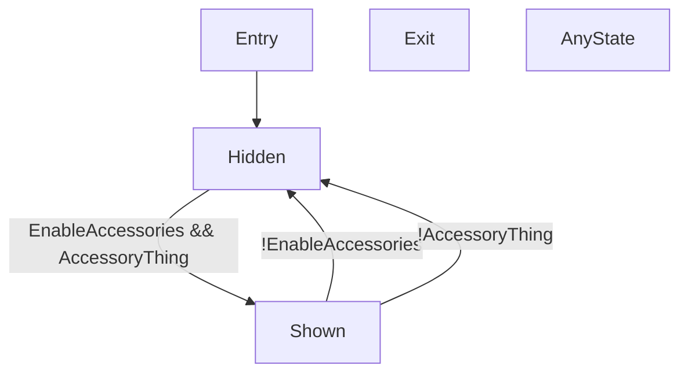

# Toggling a Skinned Mesh Renderer with two conditions
This example shows:

- Simple toggle animations
- Groups of Bool parameters
- Simple transitions

[toggle](https://raw.githubusercontent.com/Happyrobot33/av3-animator-as-code/main/Packages/com.happyrobot33.animatorascode/Editor/Framework/Examples/GenExample1_ToggleSmr.cs ":include :type=code csharp")
